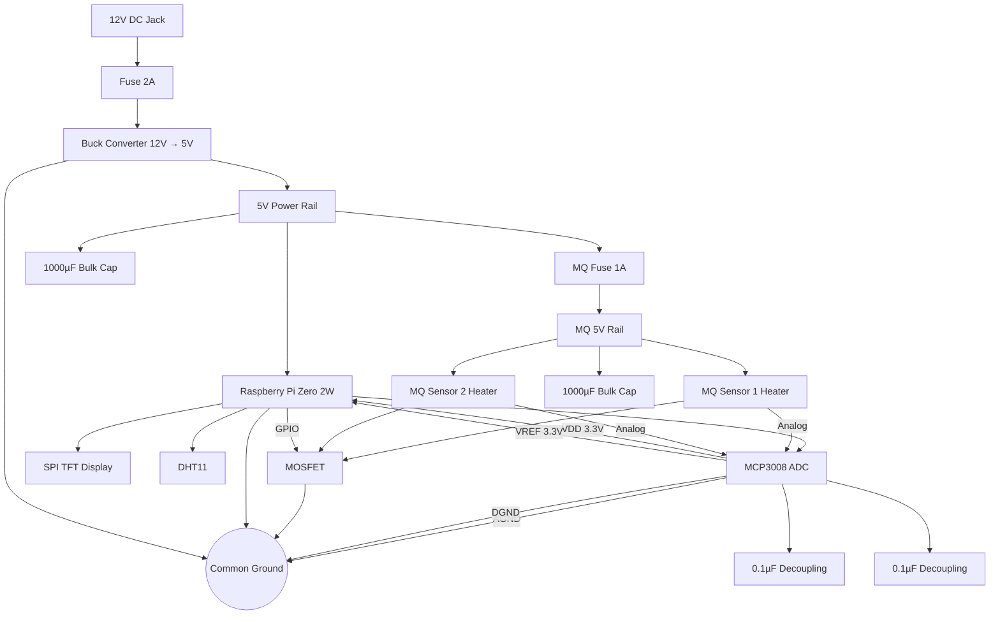

```mermaid
flowchart TD
    %% POWER INPUT
    DC12V[12V DC Jack]
    FUSE[Fuse 2A]
    BUCK[Buck Converter 12V → 5V]

    DC12V --> FUSE --> BUCK

    %% 5V RAIL
    BUCK --> V5[5V Power Rail]

    %% PI POWER
    V5 --> PI[Raspberry Pi Zero 2W]

    %% LOGIC DEVICES
    PI --> MCP[MCP3008 ADC]
    PI --> DISP[SPI TFT Display]
    PI --> DHT[DHT11]

    %% MCP DETAILS
    MCP -->|VDD 3.3V| PI
    MCP -->|VREF 3.3V| PI
    MCP -->|AGND| GND
    MCP -->|DGND| GND

    %% MQ POWER CONTROL
    V5 --> MQFUSE[MQ Fuse 1A]
    MQFUSE --> MQRAIL[MQ 5V Rail]

    %% MOSFET
    MQRAIL --> MQ1[MQ Sensor 1 Heater]
    MQRAIL --> MQ2[MQ Sensor 2 Heater]

    MQ1 --> MOSFET
    MQ2 --> MOSFET

    MOSFET --> GND
    PI -->|GPIO| MOSFET

    %% SIGNAL PATH
    MQ1 -->|Analog| MCP
    MQ2 -->|Analog| MCP

    %% CAPACITORS
    V5 --> C1[1000µF Bulk Cap]
    MQRAIL --> C2[1000µF Bulk Cap]

    MCP --> C3[0.1µF Decoupling]
    MCP --> C4[0.1µF Decoupling]

    %% GROUNDS
    GND((Common Ground))
    PI --> GND
    BUCK --> GND
```